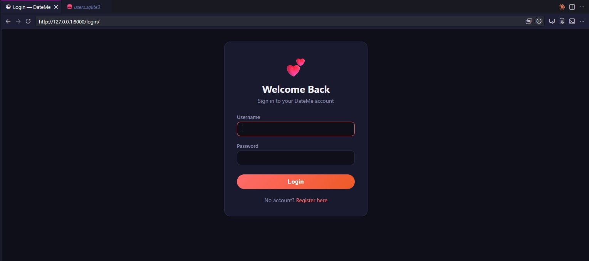
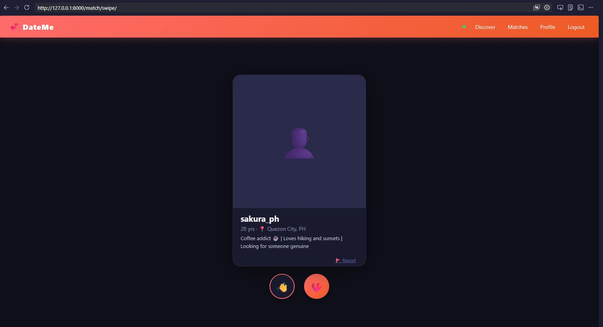
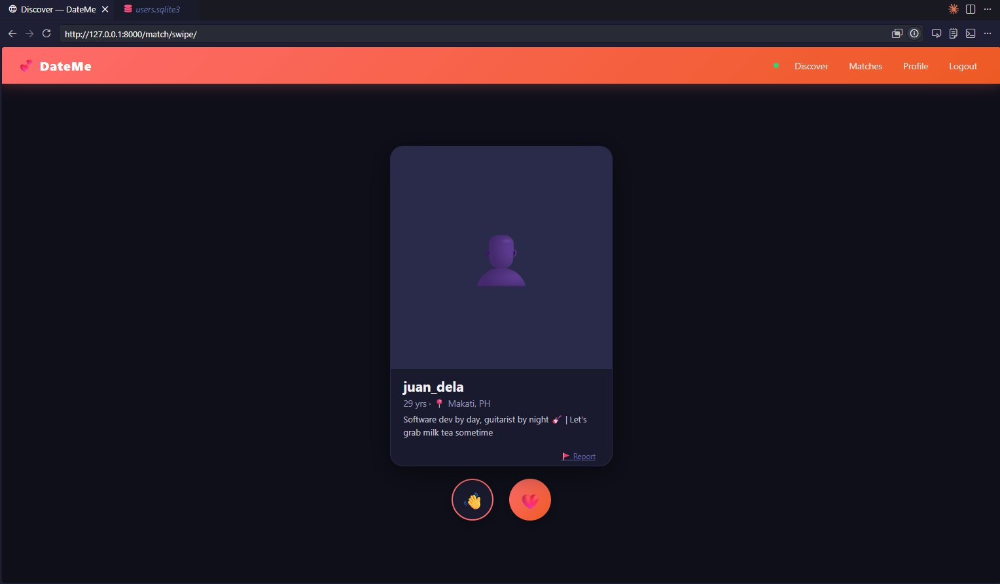
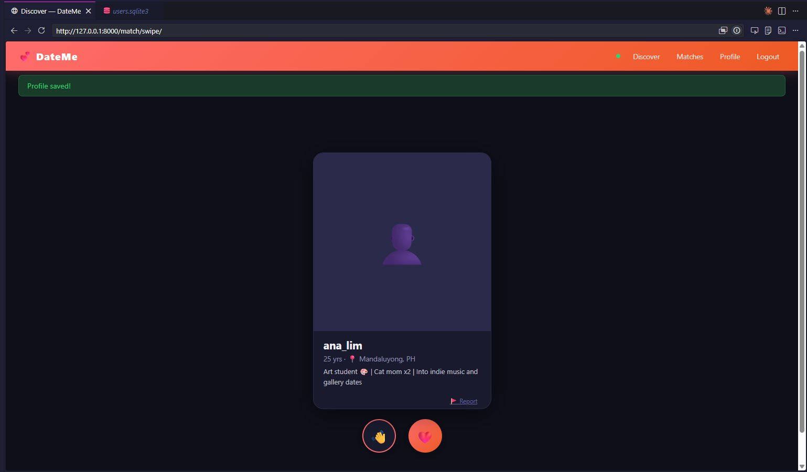
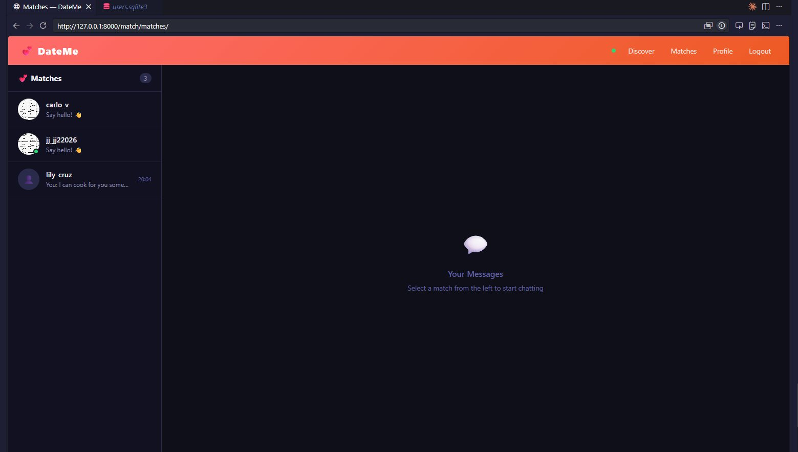
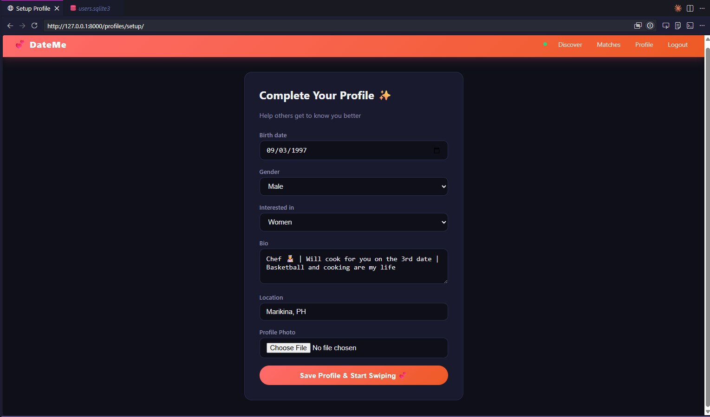
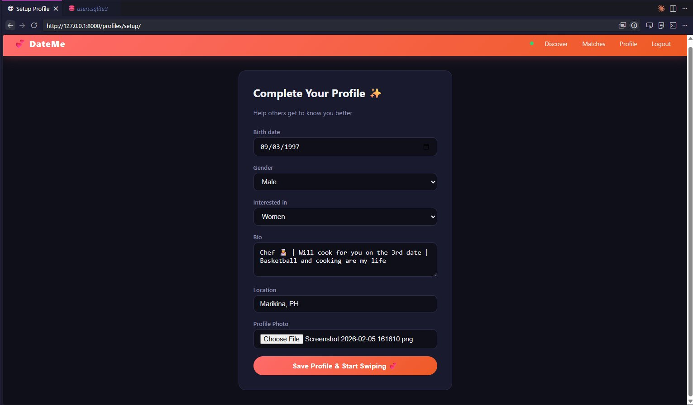
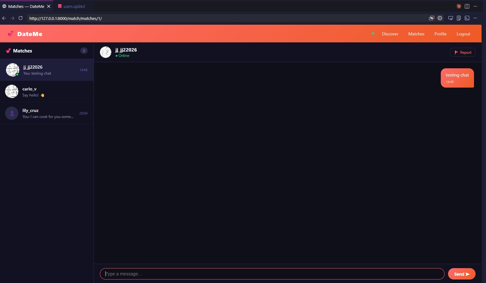
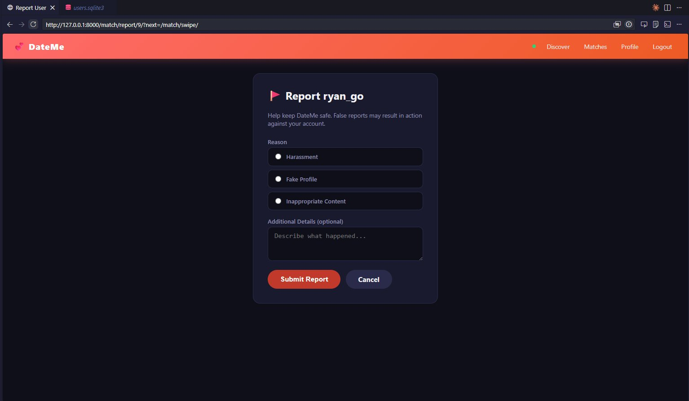
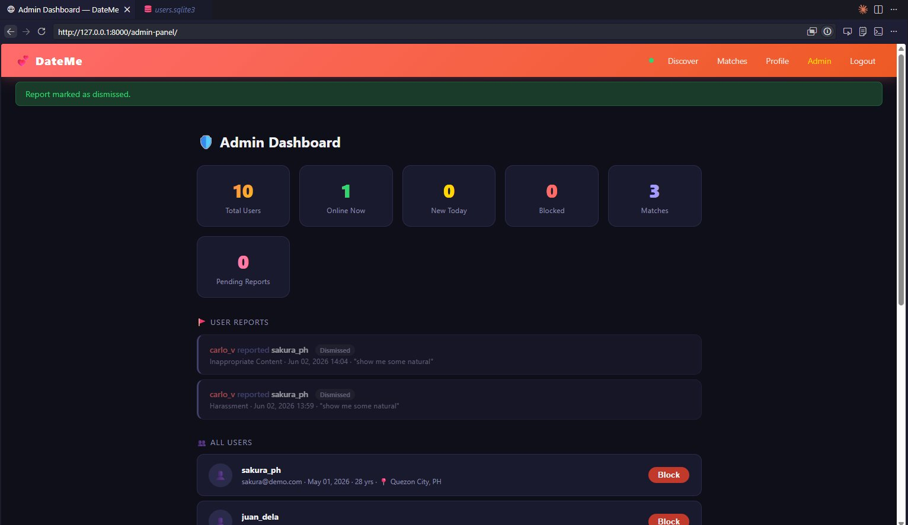

# 💘 DATEME — Django Dating App

> A Tinder-style dating web app built with Django — swipe, match, and chat in real time.

[](screenshots/login.png)

---

## ⚠️ Demo Project

All users, profiles, and data are fictional and for demonstration purposes only.

---

## ✨ Features

- 🔐 **User Authentication** — Register / login with CAPTCHA image verification and 18+ age gate
- 👤 **Profile Setup** — Upload a photo, set bio, age, gender, location, and dating preferences
- 💨 **Swipe Interface** — Drag-to-swipe card UI (Like 💚 / Pass 👋) using Vanilla JS pointer events + AJAX
- 💞 **Mutual Match Detection** — Server-side check on every swipe; auto-creates a `Match` object and fires a client-side popup
- 💬 **In-App Chat** — Short-poll AJAX chat between matched users (no WebSocket needed)
- 🚩 **Reporting System** — Report profiles for Harassment, Fake Profile, or Inappropriate Content
- 🛡️ **Admin Dashboard** — Staff-only panel with stats, block/unblock users, and report review
- 🟢 **Online Status** — Green badge if user was active within the last 5 minutes

---

## 📸 Screenshots

### Login
[](screenshots/login.png)

### Discover / Swipe cards
[](screenshots/swipe_sakura.png)
[](screenshots/swipe_juan.png)
[](screenshots/profile_saved_swipe.png)

### Profile Setup
[](screenshots/profile_setup.png)
[](screenshots/profile_setup_photo.png)

### Matches & Chat
[](screenshots/matches_list.png)
[](screenshots/chat.png)

### Report a User
[](screenshots/report_user.png)

### Admin Dashboard
[](screenshots/admin_dashboard.png)

---

## 🛠️ Tech Stack

### Backend

| Tool | Purpose |
|---|---|
| **Python 3.11+** | Core language |
| **Django 4.2+** | Web framework (MVT pattern), ORM, session auth |
| **Pillow** | CAPTCHA image generation; profile photo processing |
| **SQLite** | 3 separate databases (users, chat, media) |

### Frontend / UI

| Tool | Purpose |
|---|---|
| **Django Templates** | Server-side HTML rendering |
| **Vanilla JS (ES2020)** | Drag-to-swipe gesture, `fetch()` AJAX, chat polling, match popup |
| **Custom CSS** | Dark space-theme, card-stack layout, swipe indicators |
| **Bootstrap 5** | Base grid, navbar, utility classes |

### Database Architecture

Uses **3 separate SQLite databases** routed via a custom `AppRouter` in `settings.py`:

| File | Used by |
|---|---|
| `users.sqlite3` | `accounts`, `profiles`, `matching` apps |
| `chat.sqlite3` | `chat` app (messages) |
| `media.sqlite3` | Profile images stored as binary blobs |

---

## ⚙️ JavaScript — How It Works

All client-side logic lives in `static/js/`. No frameworks — pure Vanilla JS.

### 1. Drag-to-Swipe Gesture (`swipe.js`)

Uses the **Pointer Events API** (`pointerdown` / `pointermove` / `pointerup`) to track drag delta. When the drag exceeds a threshold the card is flung off-screen and a like or pass is sent via AJAX.

```javascript
// static/js/swipe.js
const THRESHOLD = 100;   // px before fling triggers
let startX, isDragging = false;

card.addEventListener('pointerdown', e => {
  startX = e.clientX;
  isDragging = true;
  card.setPointerCapture(e.pointerId);  // keep all events on this card
});

card.addEventListener('pointermove', e => {
  if (!isDragging) return;
  const delta = e.clientX - startX;

  // Rotate and translate the card proportional to drag distance
  card.style.transform = `translateX(${delta}px) rotate(${delta * 0.05}deg)`;

  // Fade in the LIKE / PASS indicator overlays
  likeIndicator.style.opacity  = delta > 0 ? delta / THRESHOLD : 0;
  passIndicator.style.opacity  = delta < 0 ? -delta / THRESHOLD : 0;
});

card.addEventListener('pointerup', e => {
  const delta = e.clientX - startX;
  isDragging = false;

  if (Math.abs(delta) > THRESHOLD) {
    flingCard(delta > 0 ? 'like' : 'pass');  // animate off-screen then AJAX
  } else {
    card.style.transform = '';  // snap back to center
    likeIndicator.style.opacity = 0;
    passIndicator.style.opacity = 0;
  }
});

function flingCard(action) {
  const direction = action === 'like' ? 1 : -1;
  card.style.transition = 'transform 0.4s ease';
  card.style.transform   = `translateX(${direction * window.innerWidth}px) rotate(${direction * 30}deg)`;
  card.addEventListener('transitionend', () => sendSwipe(targetUserId, action), { once: true });
}
```

---

### 2. AJAX Swipe — `fetch()` POST (`swipe.js`)

No full page reload on every swipe. Django's view returns JSON so the client can react (match popup, load next card) without leaving the page.

```javascript
// Called after the fling animation ends
async function sendSwipe(targetUserId, action) {
  const res = await fetch('/match/swipe/', {
    method: 'POST',
    headers: {
      'Content-Type': 'application/json',
      'X-CSRFToken': getCookie('csrftoken'),  // Django requires this header
    },
    body: JSON.stringify({ target_id: targetUserId, action })
  });

  const data = await res.json();
  // Response shape: { matched: true/false, match_id: 42 }

  if (data.matched) showMatchPopup(data.match_id);
  loadNextCard();  // reveal next card in the DOM stack
}

// Utility: read a cookie by name (needed for CSRF token)
function getCookie(name) {
  return document.cookie.split('; ')
    .find(r => r.startsWith(name + '='))
    ?.split('=')[1];
}
```

**Django view equivalent (`matching/views.py`):**

```python
@login_required
def swipe(request):
    if request.method == 'POST':
        data      = json.loads(request.body)
        target    = get_object_or_404(User, pk=data['target_id'])
        liked     = data['action'] == 'like'

        Swipe.objects.update_or_create(
            from_user=request.user, to_user=target,
            defaults={'liked': liked}
        )

        # Check for a mutual like
        matched = liked and Swipe.objects.filter(
            from_user=target, to_user=request.user, liked=True
        ).exists()

        match_id = None
        if matched:
            match, _ = Match.objects.get_or_create(
                user1=min(request.user, target, key=lambda u: u.pk),
                user2=max(request.user, target, key=lambda u: u.pk)
            )
            match_id = match.pk

        return JsonResponse({'matched': matched, 'match_id': match_id})

    # GET: render the swipe page
    ...
```

---

### 3. Match Popup (`swipe.js`)

When `fetch()` returns `matched: true`, a hidden overlay fades in with both avatars and a "Start chatting" CTA. No page reload needed.

```javascript
function showMatchPopup(matchId) {
  const overlay = document.getElementById('match-overlay');
  const chatBtn  = overlay.querySelector('#chat-link');

  chatBtn.href = `/chat/${matchId}/`;
  overlay.classList.add('visible');  // CSS handles the fade-in

  overlay.querySelector('#keep-swiping')
    .addEventListener('click', () => overlay.classList.remove('visible'));
}
```

```css
/* templates/matching/swipe.html — embedded <style> */
.match-overlay {
  position: fixed; inset: 0;
  background: rgba(0,0,0,0.85);
  display: flex; align-items: center; justify-content: center;
  opacity: 0; pointer-events: none;
  transition: opacity 0.35s ease;
  z-index: 999;
}
.match-overlay.visible {
  opacity: 1;
  pointer-events: all;
}
```

---

### 4. Chat Short-Polling (`chat.js`)

Real-time-style chat without WebSockets. `setInterval` fires every 3 seconds and appends only new messages (tracked by last seen ID).

```javascript
// static/js/chat.js
let lastMessageId = 0;

async function pollMessages() {
  const res  = await fetch(`/chat/poll/${matchId}/?since=${lastMessageId}`);
  const data = await res.json();
  // Response: { messages: [{ id, sender_username, text, timestamp, is_mine }, ...] }

  data.messages.forEach(msg => {
    const div = document.createElement('div');
    div.className = `message ${msg.is_mine ? 'mine' : 'theirs'}`;

    div.innerHTML = `
      <span class="bubble">${escapeHtml(msg.text)}</span>
      <span class="ts">${msg.timestamp}</span>
    `;

    chatBox.appendChild(div);
    lastMessageId = Math.max(lastMessageId, msg.id);
  });

  if (data.messages.length) {
    chatBox.scrollTop = chatBox.scrollHeight;  // auto-scroll to latest
  }
}

// Kick off polling immediately then every 3 s
pollMessages();
setInterval(pollMessages, 3000);

// Send a message via AJAX (no page reload)
sendBtn.addEventListener('click', async () => {
  const text = input.value.trim();
  if (!text) return;

  await fetch(`/chat/send/${matchId}/`, {
    method: 'POST',
    headers: {
      'Content-Type': 'application/json',
      'X-CSRFToken': getCookie('csrftoken'),
    },
    body: JSON.stringify({ text })
  });

  input.value = '';
  pollMessages();  // immediate refresh after sending
});

// XSS protection — never use innerHTML with raw user content
function escapeHtml(str) {
  return str.replace(/&/g,'&amp;').replace(/</g,'&lt;').replace(/>/g,'&gt;');
}
```

> **Production upgrade path:** Replace `setInterval` polling with [Django Channels](https://channels.readthedocs.io/) (WebSocket) or Server-Sent Events for lower latency.

---

### 5. CAPTCHA Refresh (`register.js`)

CAPTCHA is generated server-side with **Pillow** (distorted text drawn onto a PNG, saved to the session). A "Refresh" button swaps the image without reloading the form.

```javascript
// static/js/register.js
document.getElementById('refresh-captcha')
  .addEventListener('click', async () => {
    const res  = await fetch('/accounts/captcha/refresh/');
    const data = await res.json();
    // Response: { image_url: '/accounts/captcha/image/?v=1719123456' }

    // Cache-bust with a timestamp so the browser doesn't serve the old image
    document.getElementById('captcha-img').src = data.image_url + '&t=' + Date.now();
  });
```

**Django view (`accounts/views.py`):**

```python
import random, string
from PIL import Image, ImageDraw, ImageFont, ImageFilter
from io import BytesIO

def captcha_refresh(request):
    code = ''.join(random.choices(string.ascii_uppercase + string.digits, k=5))
    request.session['captcha_code'] = code
    return JsonResponse({'image_url': reverse('captcha_image')})

def captcha_image(request):
    code  = request.session.get('captcha_code', '')
    image = draw_distorted_captcha(code)   # Pillow draws + distorts text
    buf   = BytesIO()
    image.save(buf, format='PNG')
    return HttpResponse(buf.getvalue(), content_type='image/png')
```

---

## 🚀 Quick Start

### 1. Clone the repo
```bash
git clone https://github.com/your-username/DATEME.git
cd DATEME
```

### 2. Create and activate a virtual environment
```bash
# Windows
python -m venv venv
venv\Scripts\activate

# macOS / Linux
python3 -m venv venv
source venv/bin/activate
```

### 3. Install dependencies
```bash
pip install -r requirements.txt
```

### 4. Run all migrations
```bash
python manage.py makemigrations accounts profiles matching chat
python manage.py migrate
python manage.py migrate --database=chat_db
python manage.py migrate --database=media_db
```

### 5. Load dummy data (recommended for demo)
```bash
python manage.py loaddata fixtures.json
python manage.py loaddata chat_fixtures.json --database=chat_db
```

### 6. Create a superuser
```bash
python manage.py createsuperuser
```

### 7. Start the server
```bash
python manage.py runserver
```

Open **http://127.0.0.1:8000** in your browser.

---

## 👥 Dummy Users

All passwords: **`Demo@1234`**

| Username | Gender | Location |
|---|---|---|
| `sakura_ph` | Female | Quezon City, PH |
| `juan_dela` | Male | Makati, PH |
| `mia_santos` | Female | Pasig, PH |
| `carlo_v` | Male | BGC, Taguig, PH |
| `ana_lim` | Female | Mandaluyong, PH |
| `marco_t` | Male | Marikina, PH |
| `lily_cruz` | Female | Paranaque, PH |
| `ryan_go` | Male | Las Pinas, PH |
| `nina_b` | Female | Caloocan, PH |
| `alex_m` | Male | Muntinlupa, PH |

### Pre-loaded Matches (with chat messages)

| Match |
|---|
| `carlo_v` ↔ `sakura_ph` |
| `juan_dela` ↔ `mia_santos` |
| `marco_t` ↔ `lily_cruz` |

---

## 🗺️ URL Routes

| URL | Description |
|---|---|
| `/` | Login page |
| `/register/` | Register with CAPTCHA + 18+ age verification |
| `/profiles/setup/` | Edit profile — photo, bio, location, gender |
| `/match/swipe/` | Swipe card stack (GET renders page, POST handles AJAX swipe) |
| `/match/matches/` | Your mutual matches with online status |
| `/chat/<match_id>/` | Direct message with a match |
| `/chat/poll/<match_id>/` | AJAX endpoint — returns new messages since last ID |
| `/match/report/<user_id>/` | Report a user |
| `/accounts/admin-panel/` | Staff-only moderation dashboard |
| `/admin/` | Django admin panel |

---

## 📁 Project Structure

```
DATEME/
├── accounts/          # Custom user model, auth views, admin dashboard, CAPTCHA
├── profiles/          # Profile model, setup form, photo upload
├── matching/          # Swipe logic, Match model, reporting
├── chat/              # Message model, chat views, poll endpoint
├── dateme/            # Django project settings, URL config, DB router
├── templates/         # Shared base templates + per-app templates
├── static/
│   ├── css/           # Dark space-theme CSS
│   └── js/
│       ├── swipe.js   # Drag gesture + AJAX like/pass + match popup
│       ├── chat.js    # Short-poll chat + send message
│       └── register.js # CAPTCHA refresh
├── fixtures.json      # Dummy user/profile/match data
├── chat_fixtures.json # Dummy chat messages
├── manage.py
└── requirements.txt
```

---

## 🔒 Security Notes (Before Deploying)

> ⚠️ The current `settings.py` uses a **hardcoded secret key** and `DEBUG = True`.

1. Replace `SECRET_KEY` with a real secret (use `python -c "import secrets; print(secrets.token_hex())"`)
2. Set `DEBUG = False`
3. Update `ALLOWED_HOSTS` to your actual domain
4. Replace SQLite with PostgreSQL for production workloads
5. Configure media file storage (e.g. AWS S3) instead of binary DB blobs
6. Add rate limiting to the swipe and chat poll endpoints

---

## 🎨 UI Design

The app uses a **dark space-theme**:

| Element | Value |
|---|---|
| Background | Deep navy `#1a1a2e` |
| Accent | Coral-red gradient `#ff6b6b → #ee5a24` |
| Cards | Rounded with shadows + drag-to-swipe gesture |
| Online badge | Neon green `#2ed573` |

---

## 📝 License

Open for personal and educational use. Add your preferred license here.

---

## 🙋 Contributing

Pull requests are welcome! Please open an issue first to discuss what you'd like to change.
